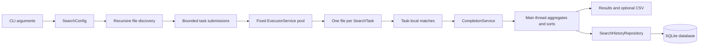
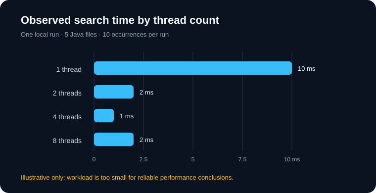

# Multithreaded File Search Engine

A Java CLI that searches text across directory trees, reports matching lines and occurrence counts, benchmarks different thread-pool sizes, and stores search history in SQLite.

## Run it
From the project directory:
```powershell
mvn test
mvn compile exec:java "-Dexec.args=src SearchEngine --extensions java --threads 4"
mvn javafx:run
```
The first command runs the automated tests. The second searches Java files under `src` for the literal text `SearchEngine` using four workers. The third opens the JavaFX desktop app.

The GUI lets you choose a directory, query, extensions, excluded folders, case handling, regex mode, and worker count. It shows matching files and line previews, and stores search history in the selected SQLite database. Searches run on a background worker so the window remains responsive.
```powershell
# Ignore letter case
mvn exec:java "-Dexec.args=src searchengine --ignore-case --extensions java"

# Search with a Java regular expression and skip generated folders
mvn exec:java "-Dexec.args=src SearchEngine.* --regex --exclude target,.git"

# Compare thread counts and save the measurements as CSV
mvn exec:java "-Dexec.args=src SearchEngine --benchmark 1,2,4,8 --csv work/benchmark.csv"

# Save a search and its matching lines in a local SQLite database
mvn exec:java "-Dexec.args=src TODO --extensions java --database search-history.db"

# View the latest saved searches
mvn exec:java "-Dexec.args=history search-history.db --limit 10"
```
## What the output means
```text
Directory: ...\src
Query: SearchEngine (case-sensitive)
Files scanned: 9
Files matched: 5
Occurrences: 16
Time: 0.033 s
Threads: 2

main\java\search\Main.java (6 occurrences)
  line 44 (2): SearchEngine engine = new SearchEngine(config);
```
- **Files scanned** counts files that passed the extension filter. The example scans the Java files under both `main` and `test`.
- **Files matched** counts files with at least one occurrence.
- **Occurrences** counts non-overlapping matches across all scanned files.
- Each result shows the path relative to the search directory, line number, and matches on that line.
- **Time** covers file reading, searching, and result collection. Directory discovery happens before the timer starts.

## How it works



`Main` parses options and creates a `SearchConfig`. `SearchEngine` walks the directory tree, applies extension and excluded-directory filters, then submits one file-search task per file. A fixed `ExecutorService` reuses the requested number of workers. Each task reads its file as UTF-8, checks each line, and returns its own result. The calling thread collects completed tasks, totals occurrences, and sorts matches by path.

Workers do not update a shared results collection. Each returns a value through a `CompletionService`, and only the coordinating thread adds it to the final lists. This keeps result aggregation thread-safe without locks or atomic counters. The number of in-flight tasks is also capped to avoid queuing every file at once.

When `--database` is supplied, `SearchHistoryRepository` writes the run summary, matched files, and matching lines using JDBC prepared statements in one transaction. `DatabaseManager` creates the schema and opens SQLite connections. The `history` command reads recent summaries back from the same database. The local `.db` file is ignored by Git.

### Database design

| Table | Stores | Relationship |
| --- | --- | --- |
| `search_runs` | Query options, thread count, file counts, occurrences, duration, timestamp | One row per search run |
| `matched_files` | Relative path and occurrence count | Many files belong to one run |
| `line_matches` | Line number, occurrence count, and matching text | Many matching lines belong to one file |

Foreign keys cascade if a parent row is deleted, and indexes support recent-run and child-row lookups. The repository uses prepared statements and commits a run plus all of its matches together, so partial history records are not left behind if a save fails.

## Benchmark

The benchmark runs the same search once for each requested pool size. This chart is the initial baseline from before the database classes were added; that run scanned five Java files:


The run found 10 occurrences each time. Lower bars mean less elapsed time, but this tiny workload is only a smoke test: the timings are rounded to milliseconds and are too small to support a performance claim. Startup costs, filesystem caching, disk I/O, scheduling, and CPU limits affect results. Use a much larger, fixed dataset; repeat each configuration; compare medians; and avoid drawing conclusions from a single run. More threads do not guarantee proportionally faster searches.

The `--csv` option writes `threads,time_seconds,files_scanned,files_matched,occurrences` for each run. The benchmark measures file searching and result collection; it does not include directory discovery.

## Options

| Option | Meaning |
| --- | --- |
| `--threads N` | Worker count; defaults to the number of available processors. |
| `--ignore-case` | Match without distinguishing uppercase and lowercase letters. |
| `--regex` | Treat the query as a Java regular expression; otherwise it is literal text. |
| `--extensions java,txt` | Search only files with these extensions. Omit to search all regular files. |
| `--exclude .git,target` | Skip directories with these names and their subtrees. |
| `--benchmark 1,2,4,8` | Run the search once for each worker count. |
| `--csv path.csv` | Save benchmark measurements to a CSV file. Use with `--benchmark`. |
| `--database path.db` | Persist each search run, matching file, and matching line in SQLite. |
| `history path.db --limit N` | Show the latest saved searches; defaults to 10. |

## Desktop interface

The JavaFX app is a separate entry point from the CLI. Both interfaces use the same `SearchEngine` and SQLite repository, so they share search behavior and saved history. The app uses JavaFX controls with a small CSS theme; Maven downloads the JavaFX modules for the current platform.

## Project map
```text
src/main/java/search/       CLI, configuration, search engine, result model
src/main/java/search/db/    SQLite connection manager, history repository, history model
src/main/java/search/ui/    JavaFX desktop interface
src/test/java/search/       Search behavior tests
src/test/java/search/db/    SQLite persistence tests
src/main/resources/search/ui/  Desktop theme
docs/benchmark.svg          Benchmark chart shown above
```
