# Multithreaded File Search Engine

A Java CLI that searches text across directory trees, reports matching lines and occurrence counts, and benchmarks different thread-pool sizes.

## Run it
From the project directory:
```powershell
mvn test
mvn compile exec:java "-Dexec.args=src SearchEngine --extensions java --threads 4"
```
The first command runs the automated tests. The second searches Java files under `src` for the literal text `SearchEngine` using four workers.
```powershell
# Ignore letter case
mvn exec:java "-Dexec.args=src searchengine --ignore-case --extensions java"

# Search with a Java regular expression and skip generated folders
mvn exec:java "-Dexec.args=src SearchEngine.* --regex --exclude target,.git"

# Compare thread counts and save the measurements as CSV
mvn exec:java "-Dexec.args=src SearchEngine --benchmark 1,2,4,8 --csv work/benchmark.csv"
```
## What the output means
```text
Directory: ...\src
Query: SearchEngine (case-sensitive)
Files scanned: 5
Files matched: 3
Occurrences: 10
Time: 0.013 s
Threads: 4

main\java\search\Main.java (4 occurrences)
  line 38 (2): SearchEngine engine = new SearchEngine(config);
```
- **Files scanned** counts files that passed the extension filter. Here, `src` contains five `.java` files across both `main` and `test`.
- **Files matched** counts files with at least one occurrence.
- **Occurrences** counts non-overlapping matches across all scanned files.
- Each result shows the path relative to the search directory, line number, and matches on that line.
- **Time** covers file reading, searching, and result collection. Directory discovery happens before the timer starts.

## How it works

```mermaid
flowchart LR
    A[CLI arguments] --> B[SearchConfig]
    B --> C[Recursive file discovery]
    C --> D[Bounded task submissions]
    D --> E[Fixed ExecutorService pool]
    E --> F[One file per SearchTask]
    F --> G[Task-local matches]
    G --> H[CompletionService]
    H --> I[Main thread aggregates and sorts]
    I --> J[Results and optional CSV]
```



`Main` parses options and creates a `SearchConfig`. `SearchEngine` walks the directory tree, applies extension and excluded-directory filters, then submits one file-search task per file. A fixed `ExecutorService` reuses the requested number of workers. Each task reads its file as UTF-8, checks each line, and returns its own result. The calling thread collects completed tasks, totals occurrences, and sorts matches by path.

Workers do not update a shared results collection. Each returns a value through a `CompletionService`, and only the coordinating thread adds it to the final lists. This keeps result aggregation thread-safe without locks or atomic counters. The number of in-flight tasks is also capped to avoid queuing every file at once.

## Benchmark

The benchmark runs the same search once for each requested pool size. This chart uses the timings printed by one run on the project's five Java source files:


The run found 10 occurrences each time. Lower bars mean less elapsed time, but this tiny workload is only a smoke test: the timings are rounded to milliseconds and are too small to support a performance claim. Startup costs, filesystem caching, disk I/O, scheduling, and CPU limits affect results. Use a much larger, fixed dataset; repeat each configuration; compare medians; and avoid drawing conclusions from a single run. More threads do not guarantee proportionally faster searches.

The `--csv` option writes `threads,time_seconds,files_scanned,files_matched,occurrences` for each run. The benchmark measures file searching and result collection; it does not include directory discovery.

## Options

| Option | Meaning |
| --- | --- |
| `--threads N` | Worker count; defaults to the number of available processors. |
| `--ignore-case` | Match without distinguishing uppercase and lowercase letters. |
| `--regex` | Treat the query as a Java regular expression; otherwise it is literal text. |
| `--extensions java,txt` | Search only files with these extensions. Omit to search all regular files. |
| `--exclude .git,target` | Skip directories with these names and their subtrees. |
| `--benchmark 1,2,4,8` | Run the search once for each worker count. |
| `--csv path.csv` | Save benchmark measurements to a CSV file. Use with `--benchmark`. |

## Project map
```text
src/main/java/search/   CLI, configuration, search engine, result model
src/test/java/search/   JUnit tests for matching, filters, regex, and exclusions
docs/benchmark.svg      Benchmark chart shown above
```
